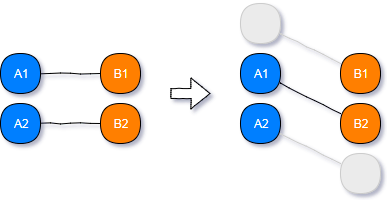
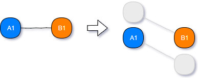
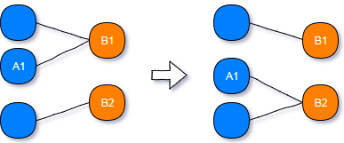
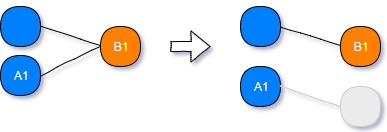
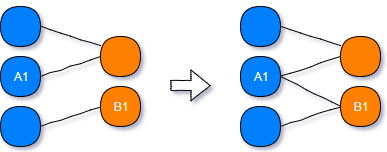
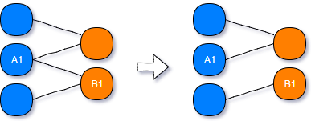

# Description

Associations between entities are represented just like in regular object-oriented PHP code using references to other objects or collections of objects.

Association is a two-way relationship between objects, so changing the relationship on only one side breaks the consistency of the data.

This requires that you choose the right side of the change (because the doctrine will only check the owning side of an association for changes).

This library makes it easy to make changes in the relations of objects, automatically changing relationships in related objects.
This makes it possible to make changes on either side of the association; since owner-side will contain a reference to the correct entity.


# Usage

### One-to-One


&nbsp;

```php
$fixer->assign($A1, $propertyName, $B2);
// or
$fixer->assign($B2, $propertyName, $A1);
```


&nbsp;

```php
$fixer->assign($A1, $propertyName, null);
// or
$fixer->assign($B1, $propertyName, null);
```


&nbsp;

### Many-to-One, One-to-Many


&nbsp;

```php
$fixer->assign($A1, $propertyName, $B2);
// or
$fixer->collectionAdd($B2, $propertyName, $A1);
```


&nbsp;

```php
$fixer->assign($A1, $propertyName, null);
// or
$fixer->collectionRemove($B1, $propertyName, $A1);
```


&nbsp;

### Many-to-Many


&nbsp;

```php
$fixer->collectionAdd($A1, $propertyName, $B1);
// or
$fixer->collectionAdd($B1, $propertyName, $A1);
```


&nbsp;

```php
$fixer->collectionRemove($A1, $propertyName, $B1);
// or
$fixer->collectionRemove($B1, $propertyName, $A1);
```


&nbsp;

[](https://travis-ci.org/Disparity/relationship-fixer)
